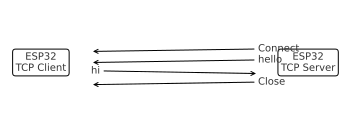
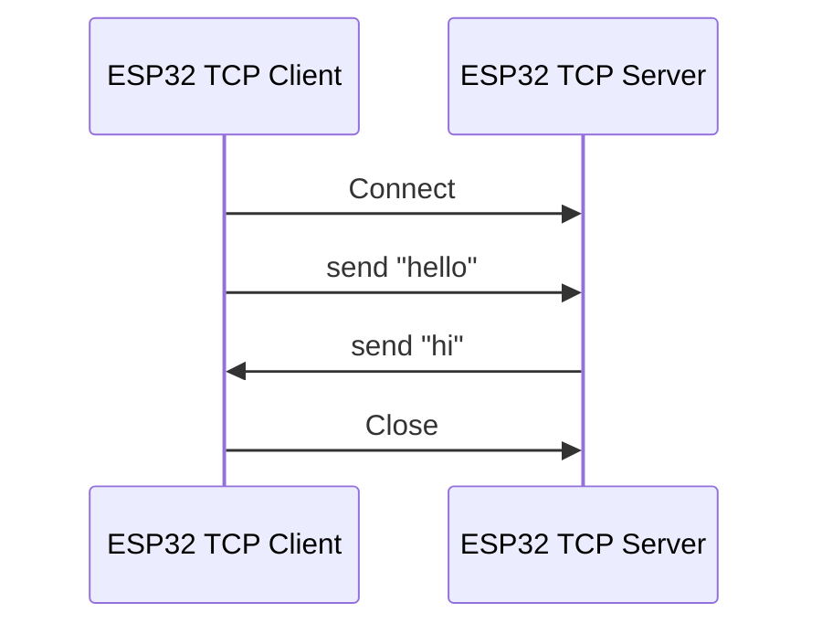
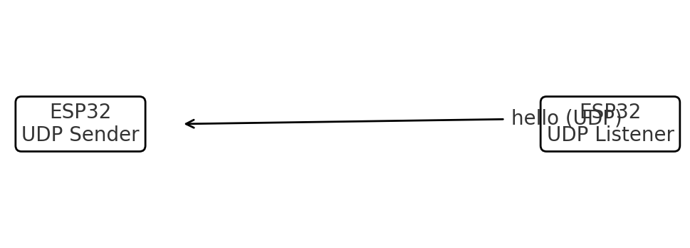
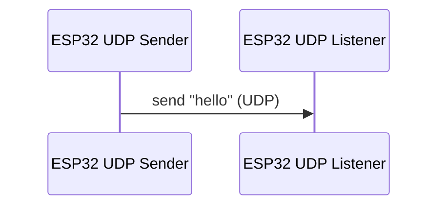

# OpenThread CLI – TCP & UDP Messaging Demo (ESP32)

<p align="center">
  
</p>

<p align="center">
  <a href="https://github.com/espressif/esp-idf">
    
  </a>
  
  
  
</p>

---

## 🌐 Overview

This repository demonstrates how to use **OpenThread CLI** on ESP32 devices to send messages between Thread nodes using **TCP** and **UDP** sockets.

It is based on the official ESP-IDF example:

```text
examples/openthread/ot_cli
```

With just CLI commands, you can:

- Form a Thread mesh network 🕸️  
- Bring multiple ESP32 nodes online  
- Open TCP and UDP sockets  
- Exchange messages between nodes  
- Inspect and debug Thread behavior in real time  

---

## 📑 Table of Contents

- [Overview](#-overview)
- [Project Structure](#-project-structure)
- [Screenshots](#-screenshots)
- [Thread Topology](#-thread-topology)
- [TCP Messaging Demo](#-tcp-messaging-demo)
- [UDP Messaging Demo](#-udp-messaging-demo)
- [OpenThread CLI Quick Reference](#-openthread-cli-quick-reference)
- [Building & Flashing](#-building--flashing)
- [Future Ideas](#-future-ideas)
- [License](#-license)

---

## 📁 Project Structure

```text
openthread-cli-demo/
├── docs/
│   ├── images/
│   │   ├── openthread-banner.png   # Your custom banner
│   │   ├── tcp_flow.png            # TCP flow diagram (generated)
│   │   ├── tcp_flow.svg
│   │   ├── udp_flow.png            # UDP flow diagram (generated)
│   │   ├── udp_flow.svg
│   │   └── topology.png            # Optional network topology diagram
│   └── diagrams/
│       ├── tcp-flow.mmd            # Mermaid source (optional)
│       └── udp-flow.mmd
├── README.md
└── LICENSE
```

> 💡 You can customize the banner and screenshots to match your YouTube video or documentation style.

---

## 📸 Screenshots

Place your screenshots in `docs/images/` and reference them here:

### TCP Demo (CLI)

```md

```

### UDP Demo (CLI)

```md

```

---

## 🕸️ Thread Topology

A simple two-node setup:

```text
        +-------------------+
        |   ESP32 Node #1   |
        |   Thread Leader   |
        |   TCP Server      |
        +---------+---------+
                  |
                  |  Thread Mesh
                  |
        +---------+---------+
        |   ESP32 Node #2   |
        |   Router / Child  |
        |   TCP/UDP Client  |
        +-------------------+
```

You can also include a topology image:

```md

```

---

## 🔁 TCP Messaging Demo

### 1️⃣ Start TCP Server (Leader Node)

```text
> tcpsockserver open
> tcpsockserver bind :: 12345
```

This opens a TCP socket server on port **12345**.

### 2️⃣ Start TCP Client (Child Node)

```text
> tcpsockclient connect <IP> <Port>
```

Example:

```text
> tcpsockclient connect fd11:22::abcd 12345
```

### 3️⃣ Exchange Messages

Client → Server:

```text
> tcpsockclient send hello
```

Server → Client:

```text
> tcpsockserver send hi
```

### 4️⃣ Close the Connection

Client:

```text
> tcpsockclient close
```

Server:

```text
> tcpsockserver close
```

### 📊 TCP Flow Diagram

PNG:

```md

```

SVG:

```md

```

Or use Mermaid in GitHub:



---

## 📡 UDP Messaging Demo

### 1️⃣ Node 1 – UDP Listener

```text
> udp open
> udp bind :: 1234
```

### 2️⃣ Node 2 – UDP Sender

```text
> udp open
> udp send <A_mesh_local_EID> 1234 hello
```

Example:

```text
> udp send fd11:22::abcd 1234 hello
```

### 📊 UDP Flow Diagram

PNG:

```md

```

SVG:

```md

```

Mermaid:



---

## 🧰 OpenThread CLI Quick Reference

Some handy commands:

```text
help
state
ipaddr
dataset active
thread start
scan
neighbor table
child table
```

- `state` – shows if node is leader/router/child  
- `ipaddr` – lists IPv6 addresses (Mesh-local, Link-local, RLOC, etc.)  
- `scan` – scans for nearby Thread networks  

---

## 🧱 Building & Flashing (ESP-IDF)

```bash
idf.py set-target esp32c6
idf.py build
idf.py flash monitor
```

Make sure OpenThread is enabled and you are using an ESP32 variant with Thread (802.15.4) support.

---

## 💡 Future Ideas

- Add Matter-over-Thread demo (On/Off Light, for example)  
- Add MQTT-over-Thread bridge  
- Integrate with OTBR (OpenThread Border Router)  
- Add Python scripts to automate CLI testing  

---

## 📜 License

This project is released under the **MIT License**.  
Feel free to use it as a starting point for your own Thread + ESP32 demos, talks, and YouTube videos.

---

> 🔔 If you use this in a video or project, consider linking back to your GitHub repo and ESP-IDF OpenThread example docs.
